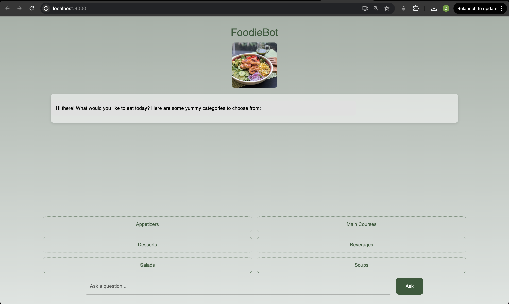

# RecipeRecommendation System
[YouTube Intro]([https://github.com/YJCatherine/RecipeRecommendation](https://www.youtube.com/channel/UCJ_r5A-dfAi8paClN8cNzPA))



RecipeRecommendation is an intelligent recommendation system designed to help users generate personalized recipe suggestions based on their dietary preferences and available ingredients. The system combines advanced machine learning algorithms and a rich ingredient database to provide accurate and diverse recipe recommendations that cater to different user needs.

## Features

### 1. User Preference Analysis
- **Dietary Preferences**: Users can set their dietary preferences, including options like vegetarian, gluten-free, low sugar, and more.
- **Allergen Filtering**: The system allows users to specify allergens (such as nuts, dairy, etc.) to ensure the recommended recipes are safe to consume.

### 2. Ingredient Management
- **Ingredient Inventory**: Users can manage their ingredient inventory by inputting the ingredients they currently have available.
- **Smart Matching**: The system recommends recipes that best match the available ingredients, reducing food waste.

### 3. Personalized Recommendations
- **History Analysis**: The system analyzes users' historical choices and ratings to provide better-suited recipe recommendations.
- **Diverse Options**: Each recommendation session provides multiple options, ensuring users have a variety of choices.

### 4. Social Interaction
- **Sharing Functionality**: Users can share their favorite recipes on social media platforms.
- **Comments and Ratings**: Users can comment on and rate recipes, helping other users make better choices.

## Technical Architecture

### Frontend
- User interface built with React.js, providing a smooth user experience.

### Backend
- Backend services powered by the Spring framework, handling user requests and data management.
- Pinecone used as the vector database to support efficient similar recipe recommendations.

### Database
- Nutritionix API used to fetch a rich set of ingredients and nutritional information.

### Deployment
- The system is deployed on the AWS cloud platform, ensuring high availability and scalability.

## Installation and Usage

### Clone the Repository

```bash
git clone https://github.com/YJCatherine/RecipeRecommendation.git
cd RecipeRecommendation
```
### Install Dependencies
- Frontend:

```bash
cd frontend
npm install
```

- Backend:

```bash
cd backend
mvn install
```

### Start the Services
- Frontend:

```bash
npm start
```

- Backend:
```
bash
mvn spring-boot:run
```

### Contribution Guidelines
We welcome contributions to RecipeRecommendation! If you have suggestions or find any issues, please submit an issue or a pull request.

### License
This project is licensed under the MIT License. For more details, please refer to the LICENSE file.
